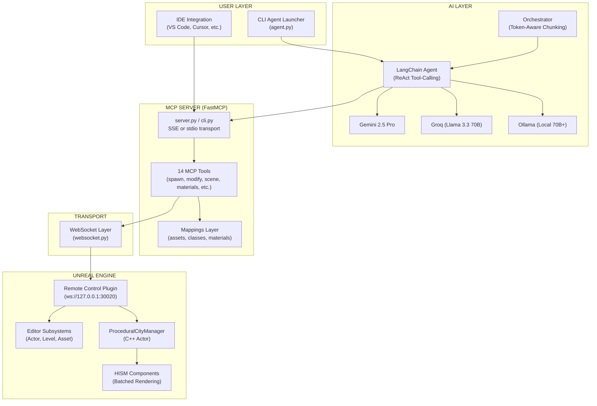
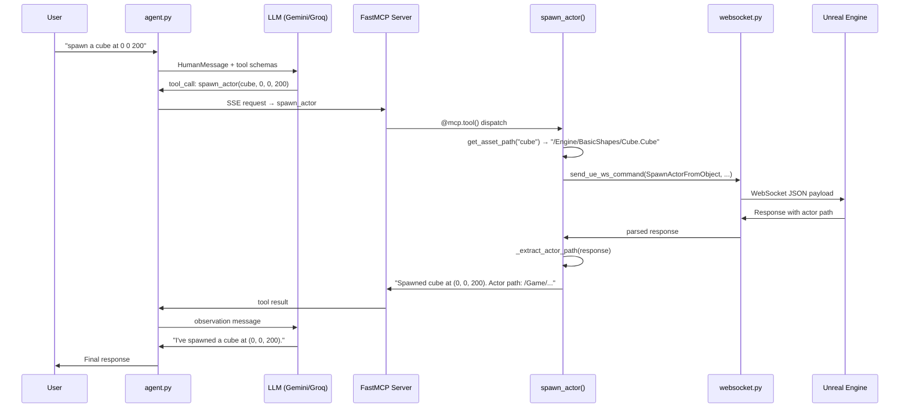
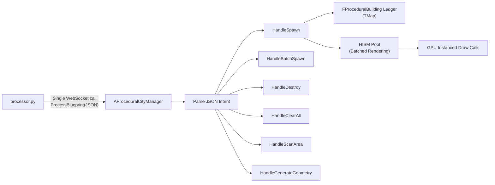

# 🎮 Unreal-MCP — Complete Interview Preparation Guide

> **Repository**: [Deepesh70/Unreal-MCP](https://github.com/Deepesh70/Unreal-MCP) · **242 commits** · **~4,500+ lines of Python** · **~1,500 lines of C++**

---

## 1. The 30-Second Elevator Pitch

> "I built **Unreal-MCP**, an open-source framework that lets AI agents control Unreal Engine in real time through natural language. It implements the **Model Context Protocol (MCP)** — the emerging standard for connecting LLMs to external tools — so you can say *'spawn a 5-story building with a pointed roof'* and watch it materialize in the 3D viewport. The system supports **Gemini, Groq, and Ollama** as interchangeable LLM backends, uses **WebSocket-based Remote Control** to communicate with Unreal Engine, and includes a **procedural city builder** that can generate entire neighborhoods from a single prompt."

---

## 2. Architecture Deep Dive

### 2.1 High-Level System Diagram



### 2.2 Component Breakdown

| Component | File(s) | Lines | Purpose |
|---|---|---|---|
| **MCP Server** | [`server.py`](file:///c:/Users/aadit/Desktop/Unreal-MCP/server.py), [`cli.py`](file:///c:/Users/aadit/Desktop/Unreal-MCP/unreal_mcp/cli.py) | ~125 | FastMCP server exposing 14 tools via SSE/stdio transport |
| **Agent Launcher** | [`agent.py`](file:///c:/Users/aadit/Desktop/Unreal-MCP/agent.py) | 108 | Multi-model CLI with --test, --interactive, --builder modes |
| **Base Agent Runner** | [`base.py`](file:///c:/Users/aadit/Desktop/Unreal-MCP/agents/base.py) | 381 | Shared MCP connection, LangChain agent creation, Builder mode |
| **LLM Backends** | [`gemini_agent.py`](file:///c:/Users/aadit/Desktop/Unreal-MCP/agents/gemini_agent.py), [`groq_agent.py`](file:///c:/Users/aadit/Desktop/Unreal-MCP/agents/groq_agent.py), [`ollama_agent.py`](file:///c:/Users/aadit/Desktop/Unreal-MCP/agents/ollama_agent.py) | ~233 | Provider-specific LangChain adapters (Gemini, Groq, Ollama) |
| **Orchestrator** | [`orchestrator.py`](file:///c:/Users/aadit/Desktop/Unreal-MCP/agents/orchestrator.py) | 211 | Token-budget-aware scene chunking for complex prompts |
| **Processor** | [`processor.py`](file:///c:/Users/aadit/Desktop/Unreal-MCP/agents/processor.py) | 1,184 | JSON routing, legacy fallback, collision detection, C++ codegen |
| **WebSocket Layer** | [`websocket.py`](file:///c:/Users/aadit/Desktop/Unreal-MCP/unreal_mcp/connection/websocket.py) | 292 | All UE communication (commands, properties, console, Python exec) |
| **14 MCP Tools** | [`unreal_mcp/tools/`](file:///c:/Users/aadit/Desktop/Unreal-MCP/unreal_mcp/tools) | ~900 | spawn, modify, destroy, scene, materials, scripting, capture, etc. |
| **Mappings** | [`unreal_mcp/mappings/`](file:///c:/Users/aadit/Desktop/Unreal-MCP/unreal_mcp/mappings) | ~160 | Friendly name → UE asset/class/material path dictionaries |
| **C++ City Manager** | [`generated/`](file:///c:/Users/aadit/Desktop/Unreal-MCP/generated) | ~1,500 | Procedural building actor with HISM pooling & spatial ledger |

---

## 3. The 14 MCP Tools (Your "API Surface")

These are the functions the AI can call. Each is decorated with `@mcp.tool()`:

| # | Tool | File | What It Does |
|---|---|---|---|
| 1 | `spawn_actor` | [`spawning.py`](file:///c:/Users/aadit/Desktop/Unreal-MCP/unreal_mcp/tools/spawning.py) | Spawn shapes, lights, cameras by friendly name |
| 2 | `list_actors` | [`actors.py`](file:///c:/Users/aadit/Desktop/Unreal-MCP/unreal_mcp/tools/actors.py) | List all actors in the level |
| 3 | `set_actor_scale` | [`transform.py`](file:///c:/Users/aadit/Desktop/Unreal-MCP/unreal_mcp/tools/transform.py) | Scale an actor by X/Y/Z |
| 4 | `get_scene_state` | [`scene.py`](file:///c:/Users/aadit/Desktop/Unreal-MCP/unreal_mcp/tools/scene.py) | Rich scene summary with types, mesh names, locations |
| 5 | `modify_actor` | [`modify.py`](file:///c:/Users/aadit/Desktop/Unreal-MCP/unreal_mcp/tools/modify.py) | Move, rotate, scale an existing actor |
| 6 | `destroy_actor` | [`modify.py`](file:///c:/Users/aadit/Desktop/Unreal-MCP/unreal_mcp/tools/modify.py) | Remove an actor (calls K2_DestroyActor) |
| 7 | `execute_python_in_editor` | [`scripting.py`](file:///c:/Users/aadit/Desktop/Unreal-MCP/unreal_mcp/tools/scripting.py) | Run arbitrary Python inside UE's embedded interpreter |
| 8 | `set_actor_property` | [`properties.py`](file:///c:/Users/aadit/Desktop/Unreal-MCP/unreal_mcp/tools/properties.py) | Set any UProperty on any UObject |
| 9 | `get_actor_property` | [`properties.py`](file:///c:/Users/aadit/Desktop/Unreal-MCP/unreal_mcp/tools/properties.py) | Read any UProperty |
| 10 | `capture_viewport` | [`capture.py`](file:///c:/Users/aadit/Desktop/Unreal-MCP/unreal_mcp/tools/capture.py) | Screenshot for AI visual feedback loop |
| 11 | `run_console_command` | [`console.py`](file:///c:/Users/aadit/Desktop/Unreal-MCP/unreal_mcp/tools/console.py) | Execute UE console commands |
| 12 | `find_assets` | [`assets.py`](file:///c:/Users/aadit/Desktop/Unreal-MCP/unreal_mcp/tools/assets.py) | Search the Content Browser for meshes, materials, etc. |
| 13 | `check_connection` | [`health.py`](file:///c:/Users/aadit/Desktop/Unreal-MCP/unreal_mcp/tools/health.py) | 4-layer health check (MCP → WS → RC API → Python plugin) |
| 14 | `set_material` / `list_materials` | [`materials.py`](file:///c:/Users/aadit/Desktop/Unreal-MCP/unreal_mcp/tools/materials.py) | Apply Starter Content materials by friendly name |
| 15 | `import_asset` / `add_starter_content` | [`import_asset.py`](file:///c:/Users/aadit/Desktop/Unreal-MCP/unreal_mcp/tools/import_asset.py) | Import FBX/OBJ/textures from disk into UE |

---

## 4. Data Flow — What Happens When You Say "Spawn a cube"



---

## 5. Design Patterns & Engineering Decisions

### 5.1 Key Design Patterns Used

| Pattern | Where | Why |
|---|---|---|
| **Decorator-based Registration** | `@mcp.tool()` in all tool files | Auto-registers tools at import time. Adding a new tool is just creating a file + importing it in `__init__.py` |
| **Strategy Pattern** | Agent backends (Gemini, Groq, Ollama) | All backends implement `create_llm()` → plug into the same `run_agent()` pipeline. Swap LLMs without changing any other code |
| **Delegator / Bridge Pattern** | `processor.py` → `ProceduralCityManager.cpp` | Python sends a single JSON string over WebSocket; C++ does all heavy-lifting (math, HISM, collision). Separation of orchestration (Python) vs. execution (C++) |
| **Graceful Degradation** | `_handle_intent_with_fallback()` | If no C++ CityManager exists in the level, processor automatically falls back to spawning individual actors via Remote Control |
| **Auto-Repair** | `_repair_truncated_json()` | LLMs hitting token limits produce truncated JSON. The processor auto-closes unclosed strings/brackets to recover |
| **AABB Collision Detection** | `_check_overlap()` / `_find_clear_position()` | Python-side spatial ledger prevents building overlap. Uses spiral search with 12 directions per ring |
| **Adapter / Mapping Layer** | `unreal_mcp/mappings/` | Friendly names ("cube", "steel", "pointlight") → UE engine paths. Single source of truth |
| **Observer (Scene Query)** | `get_scene_state()` tool | AI "sees" the scene before acting. Noise filtering removes HLOD/Landscape/Navigation actors |

### 5.2 Why These Decisions Were Made

> [!IMPORTANT]
> **Why MCP instead of a REST API?**
> MCP (Model Context Protocol) is the emerging standard by Anthropic for connecting LLMs to external systems. It means **any MCP-compatible IDE** (VS Code, Cursor, Windsurf, etc.) can control Unreal Engine without custom integrations. The framework is inherently future-proof — new AI models automatically get access to all tools.

> [!IMPORTANT]
> **Why WebSocket instead of HTTP for UE communication?**
> Unreal Engine's Remote Control plugin exposes both HTTP and WebSocket endpoints. WebSocket was chosen because: (1) persistent connections avoid TCP handshake overhead per command, (2) real-time event streaming for future enhancements, (3) the HTTP endpoint has known issues with certain Remote Control versions.

> [!IMPORTANT]
> **Why LangChain?**
> LangChain provides standardized adapters for Groq, Gemini, and Ollama. Its `langchain_mcp_adapters` package converts FastMCP tools into LangChain-compatible tool schemas automatically. This avoids writing boilerplate JSON schema definitions for each LLM provider.

> [!IMPORTANT]
> **Why a dual-mode architecture (Standard vs. Builder)?**
> - **Standard mode**: LangChain ReAct agent with full tool-calling. Great for interactive commands ("spawn a cube", "list actors").
> - **Builder mode**: Bypasses LangChain entirely. The LLM outputs strict JSON directly, which is routed through `processor.py`. This avoids ReAct's multi-turn overhead, keeping token usage under Groq's free-tier 12k TPM limit and enabling complex multi-building scenes in one shot.

---

## 6. Technical Challenges Solved

### 6.1 The "Bridge Paralysis" Bug
**Problem**: When the user said "build a house next to the bridge", the recipe matcher found "bridge" in the prompt and spawned a bridge instead of a house.
**Solution**: Changed from recipe-bypass to recipe-injection. Matched recipes are now injected as `REFERENCE TEMPLATE` context into the LLM prompt, letting the LLM reason about what to actually build. See [`base.py:252-291`](file:///c:/Users/aadit/Desktop/Unreal-MCP/agents/base.py#L252-L291).

### 6.2 Token Budget Overflow
**Problem**: Requesting "build a city with 40 buildings" exceeds any model's output token limit (~4-8K).
**Solution**: The **Orchestrator** ([`orchestrator.py`](file:///c:/Users/aadit/Desktop/Unreal-MCP/agents/orchestrator.py)) estimates building count from the prompt, calculates required tokens (`count × 200 + 150 overhead`), and splits into spatial zone-based chunks. Each chunk targets a different coordinate offset (northern section, eastern section, etc.) to prevent overlap.

### 6.3 Building Overlap Prevention
**Problem**: Multiple buildings spawning on top of each other when coordinates are close.
**Solution**: A Python-side position ledger tracks every spawned building's `(x, y, width, depth)`. The `_find_clear_position()` function uses a spiral search algorithm (12 directions × N rings) to find the nearest non-overlapping position. See [`processor.py:105-157`](file:///c:/Users/aadit/Desktop/Unreal-MCP/agents/processor.py#L105-L157).

### 6.4 Truncated JSON Recovery
**Problem**: LLMs hitting `max_tokens` produce invalid JSON (e.g., `{"ID": "House_01", "Parameters": {"Floors": 3, "Roo`).
**Solution**: `_repair_truncated_json()` walks the string tracking open brackets/braces/quotes, detects unclosed strings, and appends the necessary closing characters. See [`processor.py:574-625`](file:///c:/Users/aadit/Desktop/Unreal-MCP/agents/processor.py#L574-L625).

### 6.5 Scene Noise Filtering
**Problem**: `get_scene_state()` returned hundreds of internal UE actors (HLOD, LandscapeStreamingProxy, WorldSettings, NavigationMesh) that confused the AI.
**Solution**: A noise prefix filter removes environment actors from the main list. The response now shows "24 static meshes (Cube, Tower, Wall), 3 lights, 1 camera" instead of "200 unknown actors". See [`scene.py:26-32`](file:///c:/Users/aadit/Desktop/Unreal-MCP/unreal_mcp/tools/scene.py#L26-L32).

### 6.6 Cross-Version FastMCP Compatibility
**Problem**: FastMCP's API changed across v1, v2, and v3 — breaking the server startup.
**Solution**: The CLI uses a try/except chain: first tries FastMCP v3 `mcp.run(transport="sse")`, falls back to v2 `mcp.sse_app()`, then to v1 `mcp.http_app()`. See [`cli.py:80-93`](file:///c:/Users/aadit/Desktop/Unreal-MCP/unreal_mcp/cli.py#L80-L93).

### 6.7 Python 3.13+ Compatibility
**Problem**: The `cgi` module was removed in Python 3.13, breaking `httpcore` (a dependency of `httpx`).
**Solution**: Pinned `httpx==0.27.2` and `httpcore==1.0.7`, and added `legacy-cgi` as a compatibility shim. See [`requirements.txt`](file:///c:/Users/aadit/Desktop/Unreal-MCP/requirements.txt).

---

## 7. The C++ ProceduralCityManager

The [`ProceduralCityManager`](file:///c:/Users/aadit/Desktop/Unreal-MCP/generated/ProceduralCityManager.h) is the high-performance path for scene generation:



### Key C++ Features:
- **Single Entry Point**: `ProcessBlueprint(const FString& JsonPayload)` — one WebSocket call replaces dozens of individual spawn calls
- **HISM Pooling**: Uses `UHierarchicalInstancedStaticMeshComponent` to batch identical meshes into GPU-instanced draw calls (1000 buildings = ~10 draw calls instead of 1000)
- **Spatial Ledger**: `TMap<FString, FProceduralBuilding>` tracks all buildings by ID for modify/destroy operations
- **Collision-Aware Placement**: Auto-nudges buildings that overlap existing structures
- **Geometry Scripting**: Runtime boolean operations for CSG-style geometry via `UGeometryScript`

---

## 8. Security & Distribution

The project includes a [`Security.md`](file:///c:/Users/aadit/Desktop/Unreal-MCP/Security.md) guide and a [`build_relay.py`](file:///c:/Users/aadit/Desktop/Unreal-MCP/build_relay.py) script for:
- **PyInstaller packaging** (quick, but vulnerable to decompilation)
- **Nuitka compilation** (Python → C++ → native binary, immune to Python decompilers)
- **Hardware fingerprinting** and anti-debugging techniques for commercial distribution

---

## 9. Anticipated Interview Questions & Answers

### Q1: "Walk me through the architecture of your project."

**Answer**: "Unreal-MCP is a three-layer system. The **top layer** is an AI agent — I support Gemini, Groq, and local Ollama as interchangeable LLM backends via LangChain adapters. The **middle layer** is a FastMCP server that exposes 14 tools the AI can call — things like `spawn_actor`, `get_scene_state`, `set_material`. The **bottom layer** is a WebSocket transport that converts tool calls into Unreal Engine's Remote Control API format. The key insight is that the MCP standard makes it model-agnostic and IDE-agnostic: any MCP client can control Unreal Engine without custom code."

### Q2: "Why did you choose MCP over a REST API or gRPC?"

**Answer**: "MCP is the emerging standard for AI tool-use, adopted by Anthropic and supported by VS Code, Cursor, and other IDEs. By conforming to MCP, my server works with *any* MCP-compatible client out of the box. A custom REST API would require building separate integrations for each IDE and each LLM provider. MCP gives me future-proofing for free — when new AI models come out, they automatically get access to all my Unreal Engine tools."

### Q3: "How do you handle the LLM producing invalid or truncated JSON?"

**Answer**: "I built a JSON repair system in `processor.py`. When an LLM hits its token limit, it often cuts off mid-string or mid-object. My `_repair_truncated_json()` function walks the string tracking a stack of open brackets and braces, detects unclosed string literals by counting unescaped quotes, and appends the necessary closing characters. It also strips markdown code fences that models sometimes add despite the system prompt. This recovers probably 90%+ of truncated outputs."

### Q4: "How do you prevent buildings from overlapping?"

**Answer**: "There are two paths. In the **C++ path**, the `ProceduralCityManager` maintains a spatial ledger and performs collision checks natively. In the **Python legacy path**, I track every building's position and footprint in a Python-side ledger. Before placing a new building, `_check_overlap()` does AABB (Axis-Aligned Bounding Box) edge-to-edge distance checks with a configurable spacing buffer. If there's a collision, `_find_clear_position()` runs a spiral search — 12 directions per ring, expanding outward — until it finds a clear spot. This auto-nudging is transparent to the user."

### Q5: "What's the difference between Standard Mode and Builder Mode?"

**Answer**: "Standard mode uses LangChain's ReAct agent. The LLM decides which tools to call, gets observations back, and reasons over them — great for interactive 'spawn a cube, now scale it' workflows. Builder mode bypasses LangChain entirely. The LLM outputs raw JSON with a structured schema (Intent, ID, Parameters, Parts), and my `processor.py` routes it directly to either the C++ CityManager or the legacy spawning system. This avoids ReAct's multi-turn overhead and keeps token usage under Groq's free-tier limits. One LLM call can generate an entire multi-story building."

### Q6: "How do you make the system model-agnostic?"

**Answer**: "Through two mechanisms. First, I use LangChain's `ChatModel` abstraction — each backend just implements `create_llm()` and returns a provider-specific instance. The rest of the pipeline is identical. Second, the MCP protocol itself is model-agnostic. FastMCP advertises tool schemas in a standard format. LangChain's `langchain_mcp_adapters` converts these to native tool-call schemas for whichever provider I'm using. I can add a new LLM backend in about 40 lines of code."

### Q7: "How do you handle very large scene requests that exceed token limits?"

**Answer**: "I built an Orchestrator module. It estimates the building count from the user's prompt using regex matching and keyword heuristics (e.g., 'city' → ~100 buildings, 'village' → ~15). It then calculates whether the required output tokens exceed the model's budget (using a 70% safety margin). If so, it splits the request into spatial zones — northern section, eastern section, etc. — each with a coordinate offset to prevent overlap. Each zone gets its own LLM call with explicit instructions like 'Generate the northern section with 12 buildings, IDs Bldg_001 to Bldg_012'."

### Q8: "What was the hardest bug you fixed?"

**Answer**: "The 'Bridge Paralysis' bug. I had a recipe system where pre-defined building templates (house, bridge, tower) could bypass the LLM for faster execution. The problem was: when a user said 'build a house next to the bridge', the recipe matcher found 'bridge' in the prompt and spawned a bridge instead of a house. The fix was conceptually simple but architecturally important — I changed from recipe-bypass to recipe-injection. Now, matched recipes are injected as reference context into the LLM prompt, and the LLM reasons about what to actually build. This preserved the recipe system's value while fixing the semantic misunderstanding."

### Q9: "How does the `execute_python_in_editor` tool work?"

**Answer**: "It's a sandbox execution pipeline. The user's Python script gets wrapped in a try/except block with stdout capture and output file writing. The wrapped script is saved to a temp file. Then I send a `py 'path/to/script.py'` console command to Unreal Engine via WebSocket. The script runs inside UE's embedded Python interpreter with full access to `import unreal`. I poll the output file for results, with a configurable timeout. This single tool replaces the need for dozens of specialized tools — the AI can create Level Sequences, configure Niagara VFX, sculpt terrain, or do anything the UE Python API supports."

### Q10: "What would you improve if you had more time?"

**Answer**: "Three things: (1) **Persistent WebSocket connections** — currently every tool call opens and closes a WebSocket. I'd implement connection pooling for lower latency. (2) **Context window management** — heavily populated scenes can blow out the LLM's context window. I'd add pagination and intelligent summarization to `get_scene_state`. (3) **Visual feedback loop** — the `capture_viewport` tool exists but isn't deeply integrated. I'd pipe screenshots through a vision model for autonomous 'build → verify → adjust' cycles."

### Q11: "Tell me about the testing strategy."

**Answer**: "I took a pragmatic approach. The `--test` flag runs a minimal integration test — it connects to MCP, loads tools, and calls `list_actors` with a single API call. The `check_connection` tool performs a comprehensive 4-layer health check: MCP Server → WebSocket → Remote Control API → Python Plugin. For the processor, the JSON repair and schema validation functions are deterministic and can be unit-tested in isolation. The `scratch/test_ue_conn.py` script is a standalone WebSocket connectivity test."

### Q12: "How does auto-registration of tools work?"

**Answer**: "It uses Python's decorator + import system. The shared `mcp` instance is created in `unreal_mcp/__init__.py`. Each tool file imports `mcp` and decorates its functions with `@mcp.tool()`. The `tools/__init__.py` imports every tool module — this triggers the decorators to fire at import time, registering all tools. To add a new tool, you just: (1) create a `.py` file in `tools/`, (2) import `mcp` and decorate your function, (3) add one import line in `tools/__init__.py`. Zero boilerplate."

---

## 10. Key Metrics to Cite

| Metric | Value |
|---|---|
| Total Python LOC | ~4,500+ |
| Total C++ LOC | ~1,500 |
| Git Commits | 242 |
| MCP Tools | 14 (+ 2 sub-tools) |
| Supported LLM Backends | 3 (Gemini, Groq, Ollama) |
| UE Communication Functions | 5 (`send_command`, `send_property`, `get_property`, `send_console`, `execute_python`) |
| Material Mappings | 22 (metals, stone, wood, ground, architecture) |
| Asset Mappings | 18 (shapes + Starter Content props) |
| Structure Types (Builder) | 4 (Building, Solid, Bridge, Composite) |
| Collision Detection Algorithm | AABB + 12-direction spiral search |

---

## 11. Technology Stack Summary

```
┌─────────────────────────────────────────────────────────┐
│  PYTHON 3.10+                                           │
│  ├── FastMCP          — MCP protocol server              │
│  ├── LangChain        — LLM orchestration + adapters     │
│  ├── langchain_groq   — Groq Cloud (Llama 3.3 70B)      │
│  ├── langchain_google_genai — Google Gemini 2.5 Pro      │
│  ├── langchain_ollama — Local Ollama (70B+ models)       │
│  ├── websockets       — UE Remote Control transport      │
│  ├── python-dotenv    — Environment configuration        │
│  ├── Jinja2           — C++ template rendering           │
│  └── httpx / httpcore — HTTP client (pinned versions)    │
│                                                          │
│  C++ (UNREAL ENGINE 5)                                   │
│  ├── ProceduralCityManager — Master builder actor        │
│  ├── ProceduralBuildingTypes — FProceduralBuilding struct │
│  ├── HISM Components  — GPU-instanced rendering          │
│  └── Geometry Scripting — Runtime CSG operations         │
│                                                          │
│  PROTOCOLS                                               │
│  ├── MCP (Model Context Protocol) — AI ↔ Server          │
│  ├── SSE (Server-Sent Events) — MCP transport            │
│  ├── WebSocket — Server ↔ Unreal Engine                  │
│  └── Remote Control API — UE's built-in automation       │
└─────────────────────────────────────────────────────────┘
```

---

## 12. Talking Points for Behavioral Questions

### "Tell me about a time you made a difficult design decision"
→ **Dual-mode architecture** (Standard vs Builder). Standard mode was feature-complete but consumed too many tokens for complex scenes. I designed Builder mode as a separate path that bypasses LangChain entirely, reducing token usage by ~80% for structured generation while keeping the flexible Standard mode for interactive use.

### "Tell me about a time you iterated on a design"
→ **Scene Query evolution**. Version 1 returned raw actor paths ("200 unknown actors"). Version 2 added type inference, noise filtering, mesh name resolution, and proximity search. The AI went from blind to having rich spatial awareness with one tool call.

### "Tell me about how you handled technical debt"
→ **Legacy format migration**. As the schema evolved (from `{"Action":"SpawnActor"}` to `{"Intent":"Spawn"}`), I built a `_migrate_legacy_format()` function that auto-converts old payloads on the fly, so older saved prompts still work. The ID deduplication system similarly prevents session-level conflicts without requiring any user changes.

### "How do you ensure code quality?"
→ Comprehensive docstrings on every function, structured logging to both console and file (`logs/audit.log`), schema validation before forwarding to Unreal, and graceful error handling at every WebSocket boundary. The codebase follows a consistent pattern: try the operation → catch specific errors → return helpful error messages with fix instructions.

---

## 13. Repository File Map (Quick Reference)

```
Unreal-MCP/
├── server.py                    # Entry point (backward-compatible)
├── agent.py                     # Multi-model CLI launcher
├── pyproject.toml               # Package config (pip-installable)
├── requirements.txt             # Dependencies
├── .env.example                 # Environment variables template
│
├── unreal_mcp/                  # Core MCP server package
│   ├── __init__.py              # FastMCP instance + tool auto-registration
│   ├── cli.py                   # CLI (SSE/stdio, port auto-fallback)
│   ├── config/settings.py       # All settings in one place
│   ├── connection/websocket.py  # WebSocket transport (5 functions)
│   ├── mappings/                # Friendly name → UE path dictionaries
│   │   ├── assets.py            #   shapes + props
│   │   ├── classes.py           #   lights + actor classes
│   │   └── materials.py         #   Starter Content materials
│   ├── tools/                   # 14 MCP tools
│   │   ├── actors.py            spawning.py    transform.py
│   │   ├── scene.py             modify.py      scripting.py
│   │   ├── properties.py        capture.py     console.py
│   │   ├── assets.py            health.py      materials.py
│   │   └── import_asset.py
│   └── utils/response.py       # Shared parsing helpers
│
├── agents/                      # LLM backend implementations
│   ├── base.py                  # Shared runner + Builder mode logic
│   ├── gemini_agent.py          # Google Gemini adapter
│   ├── groq_agent.py            # Groq Cloud adapter
│   ├── ollama_agent.py          # Local Ollama adapter
│   ├── orchestrator.py          # Token-aware scene chunking
│   └── processor.py             # JSON routing + legacy fallback (1184 LOC)
│
├── generated/                   # C++ code for Unreal Engine
│   ├── ProceduralCityManager.h/.cpp
│   ├── ProceduralBuildingTypes.h
│   ├── FreezeTrap.h/.cpp        # Example generated class
│   └── AntiGravityZone.h        # Example generated class
│
├── templates/                   # Jinja2 templates for C++ codegen
│   ├── ActorHeader.h.j2
│   └── ActorSource.cpp.j2
│
├── recipes/buildings.json       # Pre-defined building templates
├── Security.md                  # Anti-reverse-engineering guide
├── research_paper.md/.tex       # Academic research paper
└── docs/                        # Architecture & flow documentation
```
