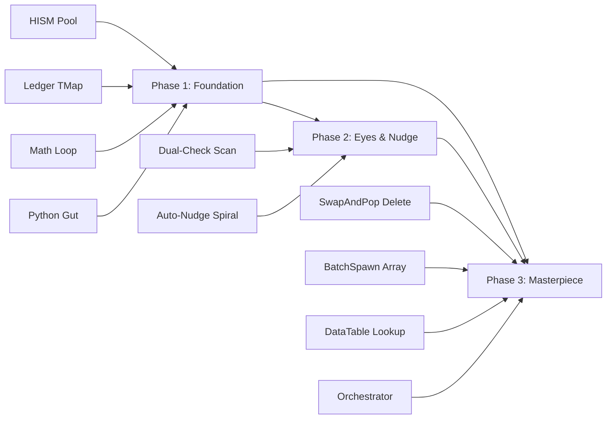

# 🚀 The Three Phases — Execution Roadmap

> The step-by-step plan for building the Delegator architecture. Each phase is independently testable.

---

## Why Phases?

Building the entire system at once guarantees failure. If C++ parsing fails AND the Python forwarder is broken AND the HISM pool has a bug — you won't know which layer is at fault. Phased development means:

1. Build and test the foundation
2. Layer on intelligence
3. Add the masterpiece features

Each phase has a clear **"it works when..."** success criteria.

---

## Phase 1: The Core Foundation (Levels 3 & 4)

### What Gets Built

| Component | Description |
|-----------|-------------|
| `ProceduralBuildingTypes.h` | All UStructs (FHISMInstanceRef, FProceduralBuilding, FAssetDictionaryRow) |
| `ProceduralCityManager.h/.cpp` | Actor class with ProcessBlueprint, HandleSpawn, HandleClearAll |
| Python refactor of `processor.py` | Gut _handle_spawn_actor, add _handle_unreal_intent |
| Updated `BUILDER_SYSTEM_PROMPT` | New JSON contract (Spawn + ClearAll only) |

### What Gets Removed from Python

```diff
- _SHAPE_ASSETS dictionary (6 entries)
- _FLOOR_HEIGHT, _BUILDING_WIDTH, _WALL_THICKNESS constants
- _spawn_and_scale() helper function
- _handle_spawn_actor() (160 lines of spatial math)
```

### What Gets Added to Python

```diff
+ _discover_city_manager() — finds the actor in the level
+ _handle_unreal_intent() — single WebSocket forwarder
+ Legacy "SpawnActor" → "Spawn" auto-migration
```

### The C++ Capabilities (Phase 1)

| Intent | Supported |
|--------|-----------|
| `Spawn` | ✅ (blind spawn, no overlap checking) |
| `ClearAll` | ✅ |
| `BatchSpawn` | ❌ Phase 3 |
| `Modify` | ❌ Phase 3 |
| `Destroy` | ❌ Phase 3 |
| `ScanArea` | ❌ Phase 2 |

### ✅ Success Criteria

```bash
# Test 1: Build a basic house
python agent.py groq -b --prompt "Build a 3-story house at the origin"

# Expected:
# - Python sends ONE WebSocket call (not 26)
# - Unreal spawns HISM instances (16 total: 5×3 pieces + 1 roof)
# - Python receives JSON receipt: {"Status": "Success", "ID": "..."}
# - No individually spawned StaticMeshActors in the Outliner — just the CityManager

# Test 2: Clear everything
python agent.py groq -b --prompt "Clear everything"

# Expected: All HISM instances removed. Outliner shows only the CityManager.

# Test 3: Legacy mode still works
python agent.py groq --prompt "spawn a cube at 0 0 200"

# Expected: Standard MCP tool still spawns a regular actor.

# Test 4: RoofType
python agent.py groq -b --prompt "Build a cabin with a pointed roof"

# Expected: Cone mesh on top instead of flat slab.
```

---

## Phase 2: The Eyes & The Nudge (Level 8)

### What Gets Built

| Component | Description |
|-----------|-------------|
| `HandleScanArea()` in C++ | Dual-Check: physics traces for external + Ledger iteration for internal |
| `FindClearLocation()` in C++ | Spiral search for nearest clear spot |
| `IsExternallyClear()` in C++ | BoxOverlapActors check |
| `IsInternallyClear()` in C++ | Ledger FVector::Dist check |
| Updated system prompt | Teaches LLM about ScanArea intent |

### C++ Capabilities After Phase 2

| Intent | Supported |
|--------|-----------|
| `Spawn` | ✅ + auto-nudge when `RequiresScan: true` |
| `ClearAll` | ✅ |
| `ScanArea` | ✅ |
| `BatchSpawn` | ❌ Phase 3 |
| `Modify` | ❌ Phase 3 |
| `Destroy` | ❌ Phase 3 |

### ✅ Success Criteria

```
Test 1: External obstacle avoidance
- Place a large cube actor at X:100, Y:0, Z:0 in the level
- Run: "Build a house at X:100 Y:0 Z:0"
- Expected: House is auto-nudged to clear ground. Receipt: "Success_Nudged"

Test 2: Ground height adjustment
- Create a landscape with a hill at X:500
- Run: "Build a house at X:500 Y:0 Z:0"
- Expected: House is placed ON the hill, not floating above or sunk into it

Test 3: Internal obstacle awareness
- Build two houses close together
- Run: "Build a third house between them"
- Expected: Third house is nudged away from the other two (detected via Ledger, not physics)

Test 4: ScanArea query
- Run: "Scan the area at 0 0 0 with radius 2000"
- Expected: Receipt lists all external and internal obstacles in range
```

---

## Phase 3: The Masterpiece

### What Gets Built

| Component | Description |
|-----------|-------------|
| `HandleBatchSpawn()` in C++ | Array processing, sequential spawn with inter-building awareness |
| `HandleModify()` in C++ | Destroy old + rebuild with new params |
| `HandleDestroy()` in C++ | Swap-and-pop safe single building removal |
| `DestroyBuilding()` internal helper | The core deletion algorithm |
| `SwapAndPopReindex()` | Ledger correction after HISM deletion |
| `ResolveMesh()` upgrade | DataTable lookup with fallback |
| `orchestrator.py` in Python | Token-aware complexity routing |
| `_validate_intent_schema()` in Python | Full schema validation |
| `docs/ASSET_DICTIONARY.md` | User guide for the DataTable |

### C++ Capabilities After Phase 3 (FULL SYSTEM)

| Intent | Supported |
|--------|-----------|
| `Spawn` | ✅ + auto-nudge |
| `BatchSpawn` | ✅ + per-building auto-nudge + inter-batch awareness |
| `Modify` | ✅ + swap-and-pop safe |
| `Destroy` | ✅ + swap-and-pop safe |
| `ClearAll` | ✅ |
| `ScanArea` | ✅ + Dual-Check |

### ✅ Success Criteria

```
Test 1: BatchSpawn
- "Build a street with a wooden house on the left and a concrete office on the right"
- Expected: Two buildings with different styles at different locations

Test 2: Modify
- "Change the wooden house to a glass skyscraper"
- Expected: Old house removed, new skyscraper at same location.
  Other building unaffected.

Test 3: Destroy
- "Destroy the office building"
- Expected: Office removed. Remaining house's HISM indices are still correct.

Test 4: Batch with inter-building awareness
- "Build 5 houses in a row"
- Expected: No overlap between houses. Each auto-nudged if needed.

Test 5: DataTable (manual)
- Populate the AssetDictionary DataTable with custom meshes
- "Build a brick house"
- Expected: Uses the DataTable meshes instead of gray cubes

Test 6: Complexity routing
- With Groq (4k token limit): "Build a village with 30 buildings"
- Expected: Orchestrator splits into ~3 chunks of ~10 buildings each
```

---

## Phase Dependency Graph



---

## Risk Assessment

| Risk | Level | Mitigation |
|------|-------|------------|
| C++ compilation errors from generated code | 🟡 Medium | Generated code uses `{{PROJECT_API}}` macro. Test with multiple project names. |
| WebSocket call to ProcessBlueprint fails | 🟡 Medium | Test discovery flow. Ensure actor is in level. |
| HISM instance corruption on delete | 🔴 High | Swap-and-pop algorithm is well-documented. Unit test with known index sequences. |
| LLM generates invalid Style tags | 🟢 Low | C++ gracefully falls back to basic shapes. |
| Token estimation is inaccurate | 🟢 Low | Safety margin of 70%. Repair mechanism catches truncation. |
| Multi-chunk overlap | 🟡 Medium | Coordinate partitioning + auto-nudge. Minor gaps possible. |

---

## Timeline Estimate

| Phase | Estimated Work | Dependencies |
|-------|---------------|-------------|
| Phase 1 | Core — must be rock solid | None |
| Phase 2 | Builds on Phase 1 HISM | Phase 1 complete |
| Phase 3 | Builds on Phase 1 + 2 | Phase 1 + 2 complete |

Each phase is independently deployable. Phase 1 alone gives you a working single-building system that's dramatically faster than the current Python-based approach.
